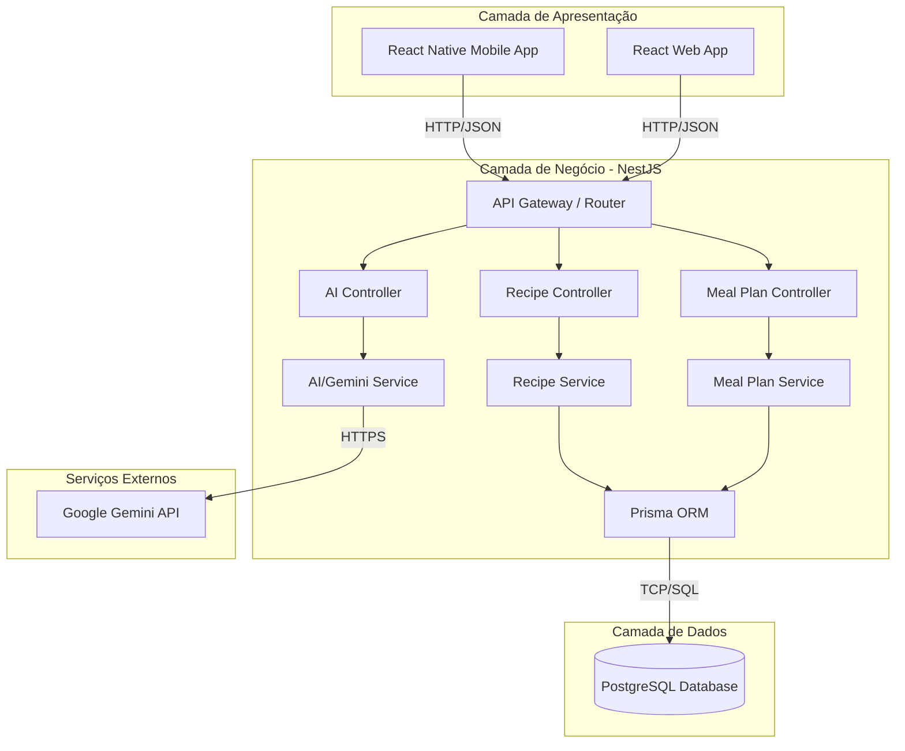

# Arquitetura do Sistema (Meal Prep AI)

Esta página documenta a arquitetura de alto nível, o fluxo de dados e os princípios de design adotados no projeto.

---

## 🏗️ Visão Geral da Arquitetura

O sistema é construído sobre uma arquitetura cliente-servidor tradicional, dividida em três partes principais: cliente (mobile/web), servidor backend (API) e banco de dados relacional, complementado por serviços externos de Inteligência Artificial.

---

## 🎨 Princípios de Design no Backend (NestJS)

Como desenvolvedor vindo do ecossistema Java, o NestJS aplica conceitos muito semelhantes aos que você já conhece:

1. **Modularidade:** Cada domínio (Receitas, Planos, Ingredientes, IA) possui seu próprio módulo contendo seus controladores, serviços e entidades.
2. **Injeção de Dependências:** O NestJS gerencia a instanciação e ciclo de vida das classes através do seu container IoC (Inversion of Control), facilitando a escrita de testes unitários e mockagem.
3. **DTOs (Data Transfer Objects):** Validação estrita de payloads de entrada via class-validator no NestJS (equivalente ao JSR 380 / Bean Validation do Java).
4. **Clean Architecture:** Mantemos os controllers apenas como portas de entrada/saída (recebem requisição HTTP, validam e retornam resposta), delegando toda a regra de negócio para a camada de Service.

---

## 🤖 Fluxo de Integração com IA

O fluxo para gerar receitas com IA baseadas em estoque funciona da seguinte maneira:

1. O usuário seleciona os ingredientes que possui na interface.
2. O aplicativo envia uma lista de strings (ex: `["frango", "tomate", "cebola"]`) para o endpoint `/recipes/generate-from-ingredients`.
3. O `AIService` envia um Prompt estruturado para a API do Gemini.
4. O Prompt instrui a IA a retornar a receita estritamente em formato JSON estruturado (com título, modo de preparo detalhado, ingredientes e quantidades).
5. O backend recebe o JSON do Gemini, faz o parse e retorna para o aplicativo.
